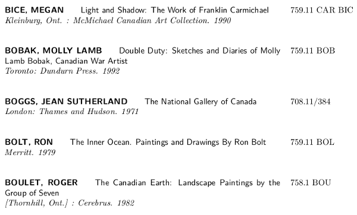

nlpltc: Generate a nice-looking printed LibraryThing catalogue

William Denton <wtd@pobox.com>

Written for the [Hackfest at Access 2010 (15 October 2010, Winnipeg MB)](http://access2010.lib.umanitoba.ca/node/3.html).

Thanks to Hackfest project partners: Ganga Dakshinamurti, Wendy Huot, and Rebecca Larocque. Chris Charles found and fixed a bug at Hackfest at Code4Lib North (6 May 2011, Hamilton ON).

# Usage

First, obtain a CSV export from your LibraryThing collection: [https://www.librarything.com/more/import](https://www.librarything.com/more/import)

Then:

    $ nlpltc your-lt-export.csv > catalogue.tex
    $ pdflatex catalogue.tex

That will produce catalogue.pdf.

# Requirements

LaTeX!  The [TeX Live](https://www.tug.org/texlive/) distribution should include everything you need.

Also Ruby. You will also need the htmlentities gem (you may need to run this under sudo):

    $ gem install htmlentities

# To Do

* Automate the getting of the export file (if you know a cookie?)
* Make it look the way Wendy specified (fonts/indenting)
* Do a subject listing, by tag
* Use Common LaTeX Service Interface (http://clsi.scribtex.com/) to automatically generate the PDF, which would mean users didn't have to run LaTeX themselves, thereby making this whole thing a lot easier to use
